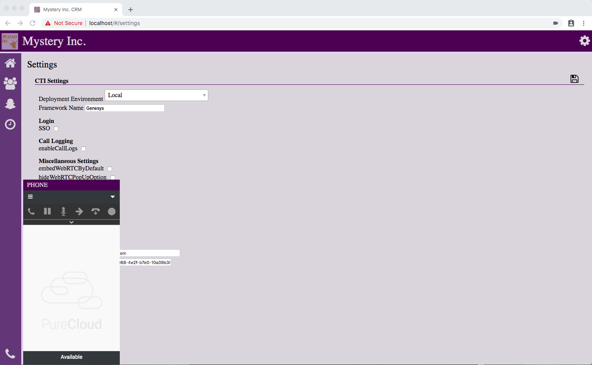

# PureCloud Embeddable Framework Mystery CRM

This repository contains an example application that mimics a custom CRM environment. The application can integrate with different PureCloud Embeddable Framework deployment environments: local, private, and production.

# Table of Contents

* [Getting Started](#getting-started)
  * [TL;DR](#tldr)
  * [Prerequisites](#prerequisites)
  * [Installation](#installation)
  * [Configuration](#configuration)
  * [Usage](#usage)
* [Additional Information](#additional-information)

# Getting Started

## TL;DR

1. Clone the repository.
2. Run `npm install`.
4. Run a local server.
5. Open the application in your browser.
6. Configure settings in the application and refresh your browser.

You can now interact with the PureCloud Embeddable Framework application.

## Prerequisites

 * Git installed on your computer.
 * Node.js (with npm) installed on your computer.
 * Ember CLI installed on your computer.
 * PureCloud credentials.
 * A PureCloud OAuth client with the **Token Implicit Grant (Browser)** grant type selected. 
   For more information, see [Create an OAuth client (Resource Center)](https://help.mypurecloud.com/?p=188023).

## Installation

1. Clone the repository.
2. Run `npm install` in a command-line application.
3. Run `npm install -g ember-cli` in a command-line application.

## Configuration

1. Run a local server.
   * Windows 
      a. Run **Command Prompt** as an administrator. 
      b. Type `cd {name of your PureCloud Embeddable Framework project}`. 
      c. Type `ember serve --port 443`.
   * macOS 
      a. Open a **Terminal** window. 
      b. Type `cd {name of your PureCloud Embeddable Framework project}`. 
      c. Type `sudo ember serve --port 443`.
2. Wait until you see "Build successful...Serving on https://localhost:443/" in the Command Prompt/Terminal window.
3. In your browser, go to https://localhost:443.
4. Configure the application. 
   a. Click the gear icon. 
   b. Edit the following required fields:
      * **Deployment Environment**: Select the correct PureCloud Embeddable Framework deployment environment for your integration.
      * **Framework Name**: Add a unique name for your integration.
      * **PureCloud Environment**: Indicate the region where your PureCloud organization is located.  
      For a list of values, see property names under [clientIds (Developer Center)](https://developer.mypurecloud.com/api/embeddable-framework/configMethods/clientIds.html).
      * **PureCloud Client ID**: Add the Client ID from the OAuth client that you created in PureCloud.   For more information about the OAuth client, see [Prerequisites](#prerequisites). </ul>
   c. (Optional) Edit the other fields. For more information about these fields, see the [PureCloud Embeddable Framework documentation](https://developer.mypurecloud.com/api/embeddable-framework/) in the Developer Center. 
   d. To save your changes, click the disk icon. 
5. Refresh your browser. The configuration changes now take effect.

## Usage

After you complete the steps under **Configuration**, click the phone icon and log in to the client with your PureCloud credentials.

You can now interact with the application and explore functionality in a PureCloud Embeddable Framework deployment environment.

# Additional Information

This content is [licensed](/LICENSE) under the MIT license.

For more information about PureCloud Embeddable Framework, see [PureCloud Embeddable Framework overview (Developer Center)](https://developer.mypurecloud.com/api/embeddable-framework/) and [About PureCloud Embeddable Framework (Resource Center)](https://help.mypurecloud.com/?p=196909).
